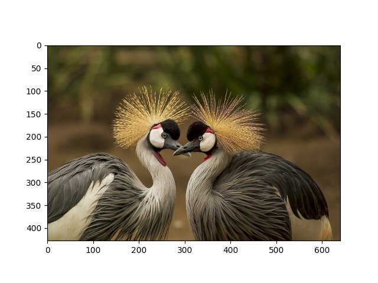
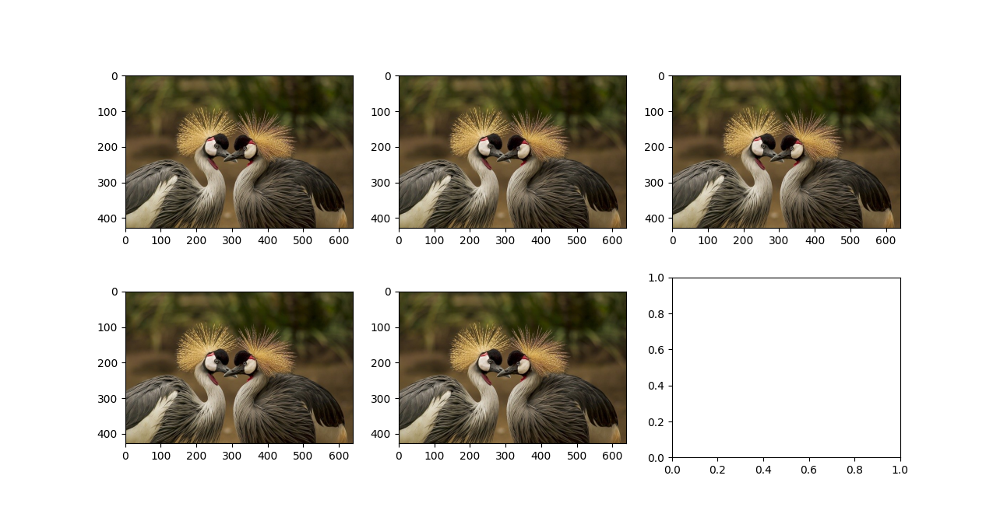
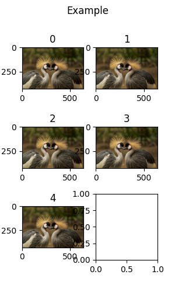

# CVUtils

CVUtils - Computer Vision Utilities  
The library of convenience utilities for computer vision experiments  
  
It is the code which I wrote during my CV experiments to simplify some repeating procedures. The code is quite old, dirty and incomplete, but may be a starting point for something more.

## Usage
Clone the repo and use as regular python package.
```python
import CVUtils as cvu

images = cvu.imread('path/to/image/folder')
cvu.imshow(images)
```

## Main features
```python
cvu.imshow(image)
```
This function allows to plot the image using matplotlib, but is more convenient. 



First of all, you can plot several images with the same call *(unfortunately does not support different image shapes yet)*
```python
cvu.imshow(images)
```
where images is array of shape (n, h, w, c)  
... or path to the folder
  

figsize and images layout are computed automatically: images are trying to form the layout that is closest to the golden ratio for better view  
  
However, you can customize the layout and the plot
```python
cvu.imshow(images, 
    shape=(3, 2), 
    figsize=(2, 4), 
    titles=[str(i) for i in range(len(images))],
    suptitle='Example')
```


You can read image, or whole image folder, or a part of it using ```max_img``` parameter.
```python
images = cvu.imread('path/to/images', max_img=100)
```
  
Common preprocessing functions are implemented like:
```python
img = cvu.imread('some_example.png')

img_norm = cvu.normalize(img) # subtract mean and divide by std

img_float = cvu.to_1(img_norm) # normalize to the range [0, 1]

img_int = cvu.to_255(img_float) # shrink into [0, 255] dtype=uint8
```

Advanced resize can be used like:
```python
cvu.resize(img, (224, 224)) # simple resize
cvu.resize(img, (224, 224),  save_aspect=True) # by long side
cvu.resize(img, (224, 244), save_aspect=True, pad=(0, 0, 0)) # pads the border black
```

You can find more in the code - it is documented.